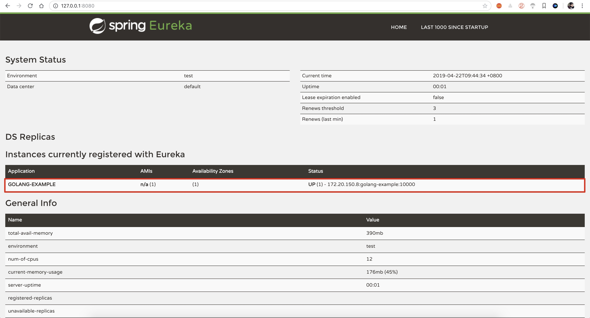

# Eureka-Client

> golang版eureka客户端



## 特点

* 心跳
* 刷新服务列表（仅仅支持全量拉取）

## 未完成

* 以delta方式刷新服务列表（增量拉取）

如果delta被禁用或者首次刷新，则使用全量拉取

## 例子

```go
package main

import (
	"encoding/json"
	"fmt"
	"net/http"
	"os"
	"os/signal"
	"syscall"

	client "github.com/xuanbo/eureka-client"
)

func main() {
	// 创建eureka client
	c := client.NewClient(&client.EurekaClientConfig{
		DefaultZone: "http://127.0.0.1:8080/eureka/",
		App:         "golang-example",
		Port:        10000,
	})
	// 启动client, 将会在后台自动注册、心跳、刷新服务列表
	c.Start()

	// Go signal notification works by sending `os.Signal`
	// values on a channel. We'll create a channel to
	// receive these notifications (we'll also make one to
	// notify us when the program can exit).
	sigs := make(chan os.Signal)
	exit := make(chan bool, 1)
	// `signal.Notify` registers the given channel to
	// receive notifications of the specified signals.
	signal.Notify(sigs, syscall.SIGINT, syscall.SIGTERM)

	// http server
	http.HandleFunc("/services", func(writer http.ResponseWriter, request *http.Request) {
		// full applications from eureka server
		services := c.Services
		
		b, _ := json.Marshal(services)
		_, _ = writer.Write(b)
	})
	server := &http.Server{
		Addr:    ":10000",
		Handler: http.DefaultServeMux,
	}

	// start http server
	go func() {
		if err := server.ListenAndServe(); err != nil {
			fmt.Println(err)
		}
	}()

	// shutdown
	// This goroutine executes a blocking receive for
	// signals. When it gets one it'll print it out
	// and then notify the program that it can finish.
	go func() {
		// receive for signals
		fmt.Println(<-sigs)

		// shutdown http server
		if err := server.Close(); err != nil {
			panic(err)
		}

		// 关闭eureka client, 会删除注册信息
		c.Shutdown()

		// notify the program that it can finish.
		exit <- true
	}()

	// The program will wait here until it gets the
	// expected signal (as indicated by the goroutine
	// above sending a value on `exit`) and then exit.
	<-exit
}
```

[例子](./examples/main.go)

## 测试

我使用的是Java`spring-cloud-starter-netflix-eureka-server`.

```xml
<dependency>
    <groupId>org.springframework.cloud</groupId>
    <artifactId>spring-cloud-starter-netflix-eureka-server</artifactId>
    <version>2.1.0.RELEASE</version>
</dependency>
```

代码如下:

[spring-cloud-v2](https://github.com/xuanbo/spring-cloud-v2)